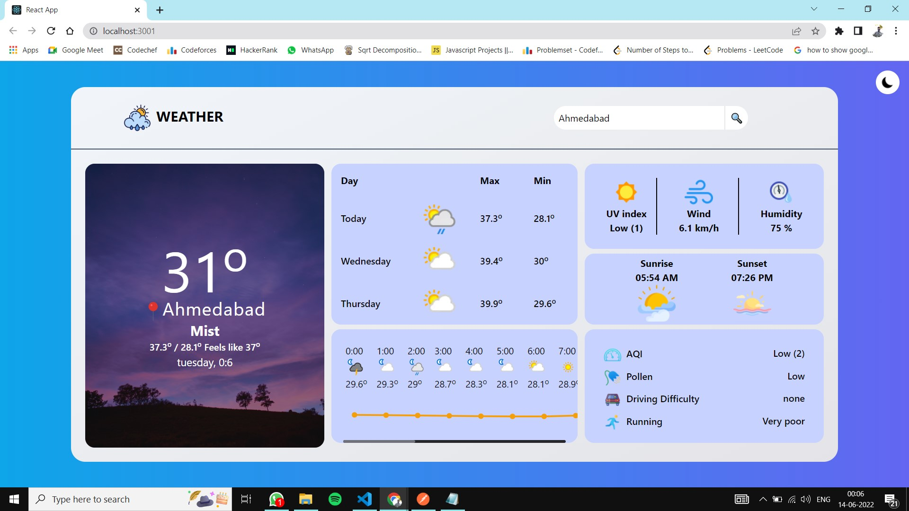
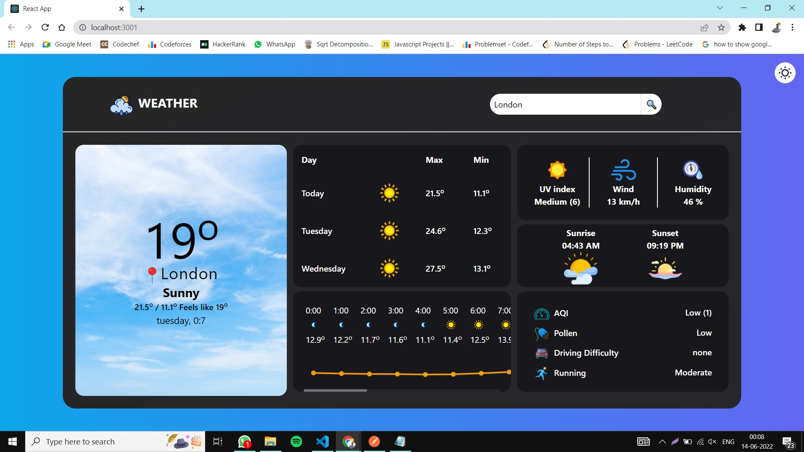

# Weather App

React app made using tailwind CSS. It helps to track Weather forecasts and current condition in real time.

<p align="center">
  <a href="https://reactjs.org/">
    
  </a>
  <a href="https://tailwindcss.com/">
    
  </a>
  <a href="https://www.chartjs.org/docs/latest/">
    
  </a>
  <a href="https://www.weatherapi.com/">
    
  </a>
</p>

## Features

- Light/dark mode toggle
- Fully Responsive
- Realtime Forecast
- Shows humidity, UV Index, Air quality, etc...


## Run Locally

Clone the project

```bash
  git clone https://link-to-project
```

Go to the project directory

```bash
  cd my-project
```

Install dependencies

```bash
  npm install
```

Start the server

```bash
  npm run start
```


## Screenshots





